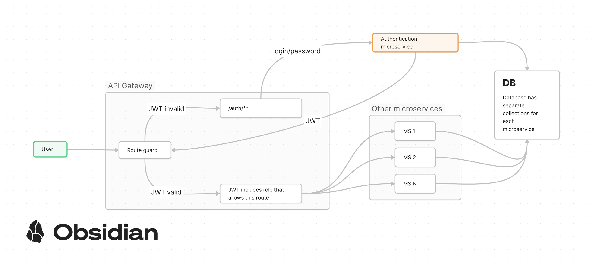

## Microservices

Microservice architecture (MA) is a Service-Oriented Architecture (SOA) that focuses on the interaction of small, loosely coupled, and easily replaceable modules — microservices. A microservice (MS) is an isolated, loosely linked unit of development that works on a single task.

### Benefits of MA

- Flexibility. Each microservice can be developed separately.
- Code Simplicity. We have many microservices, each of which performs its separate task, they have less code, and therefore, fewer dependencies, and it's easier to work with them.
- Freedom of choice in stack. For the implementation of each microservice, you can choose the stack that suits it best.
- Scalability. You can scale not everything at once, but each microservice.
- Independence of data models.
- Easier system-level testing, since any service can be mocked up
    - Avoids the need to deploy complex or expensive third-party systems
    - Allows hard-to-produce scenarios to be tested (e.g., timeouts, system failures, etc)

### Disadvantages of Microservice Architecture

- Slow start and complexity of design.
- Increased response time as a result of communication MS via HTTP.
- Set-up complexity — developers will need more DevOps competency to set up such an environment locally for development and testing.
- Need for consistency maintenance. If common entities (typescript interfaces, types, enums) are changed in one place - they should be changed in all other places too. _We already have this problem without MS._

## Authentication and Authorization

The most suitable variant for authorization and authentication is an API gateway pattern. This is a microservice, which takes the role of gateway between the client and other microservices, it accepts requests and proxies them further. This MS decides if the route is accessible for a particular request or not.

To reduce costs, we can use one MongoDB instance but different collections for each MS.

To simplify the development process, we can use Express for building API GW. Both development teams are already familiar with this framework.

